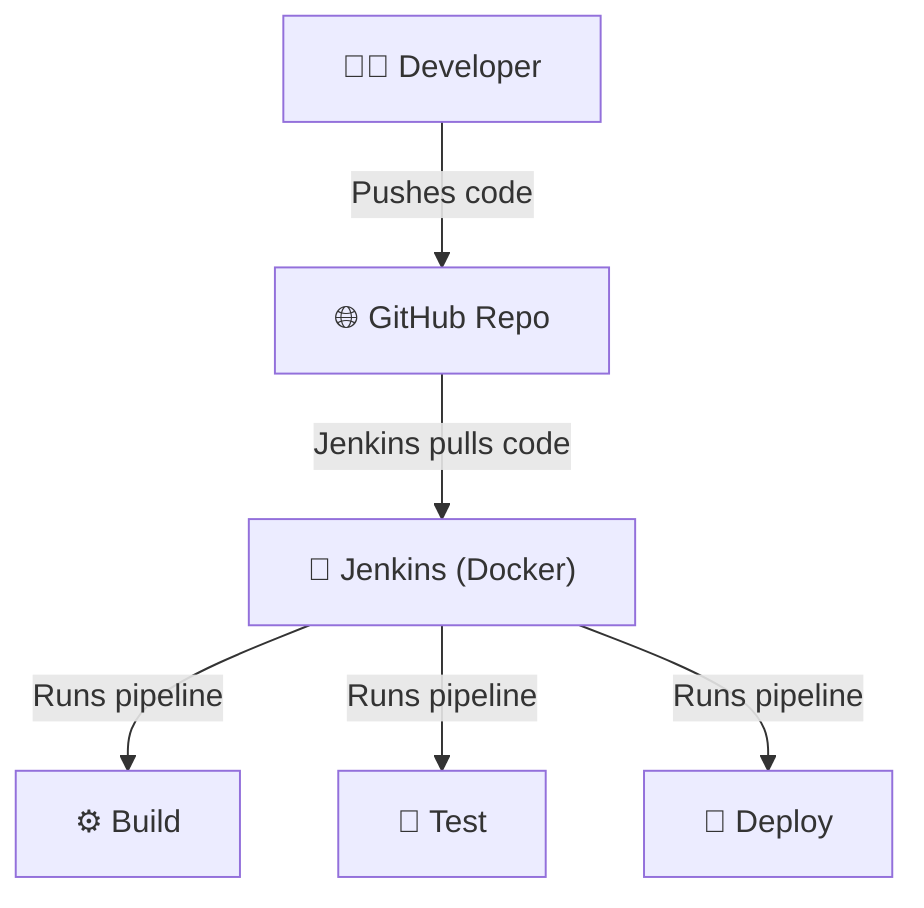

# 🚀 Jenkins Pipeline Demo

This repository demonstrates a minimal Jenkins CI/CD pipeline using shell scripts and a Jenkinsfile. It is designed for learning and testing Jenkins pipelines, especially with Jenkins running in Docker.

## 📦 Project Overview

- 📝 **hello.sh**: A simple shell script that prints a hello message.
- 🧪 **test.sh**: A shell script that tests the output of `hello.sh`.
- 🏗️ **Jenkinsfile**: Defines a Jenkins pipeline with build, test, and deploy stages.

## 🏛️ Architecture Diagram

Below is a simple architecture diagram showing how this demo project works:



- The developer pushes code to GitHub.
- Jenkins (running in Docker) pulls the latest code from the repository.
- Jenkins executes the pipeline stages: Build, Test, and Deploy.

## 🛠️ Prerequisites

- 🐳 [Docker](https://www.docker.com/get-started) installed on your system
- ☕ [Jenkins](https://www.jenkins.io/) running in Docker (see below)
- 🐙 [Git](https://git-scm.com/) installed

## 🚦 Getting Started

### 1️⃣ Clone the Repository

```sh
git clone https://github.com/Renuu007/jenkins-pipeline.git
cd jenkins-pipeline
```

### 2️⃣ Run Jenkins in Docker

```sh
docker volume create jenkins_home
docker run -d -p 8080:8080 -p 50000:50000 --name jenkins \
  -v jenkins_home:/var/jenkins_home \
  -v //var/run/docker.sock:/var/run/docker.sock \
  jenkins/jenkins:lts
```

- 🌐 Access Jenkins at [http://localhost:8080](http://localhost:8080)
- 🔑 Get the initial admin password:
  ```sh
  docker exec jenkins cat /var/jenkins_home/secrets/initialAdminPassword
  ```

### 3️⃣ Set Up the Pipeline Job in Jenkins

1. 🖥️ Open Jenkins in your browser.
2. ➕ Click **New Item** > **Pipeline**.
3. 🏷️ Name your job (e.g., `jenkins-pipeline-demo`).
4. ⚙️ Under **Pipeline** > **Definition**, select **Pipeline script from SCM**.
5. 🔗 Set **SCM** to **Git** and enter your repo URL: `https://github.com/Renuu007/jenkins-pipeline.git`
6. 🌿 Set the branch to `main`.
7. 💾 Click **Save**.

### 4️⃣ Run the Pipeline

- ▶️ Go to your pipeline job in Jenkins.
- 🏃 Click **Build Now** to run the pipeline manually.
- 📋 View the console output to see each stage (Checkout, Build, Test, Deploy).

## 📁 File Descriptions

- 🏗️ **Jenkinsfile**: Defines the pipeline stages (build, test, deploy).
- 📝 **hello.sh**: Prints a hello message.
- 🧪 **test.sh**: Tests the output of `hello.sh`.

## 🔗 Repository

- [https://github.com/Renuu007/jenkins-pipeline](https://github.com/Renuu007/jenkins-pipeline)

---

This project is for educational/demo purposes. 🎓

